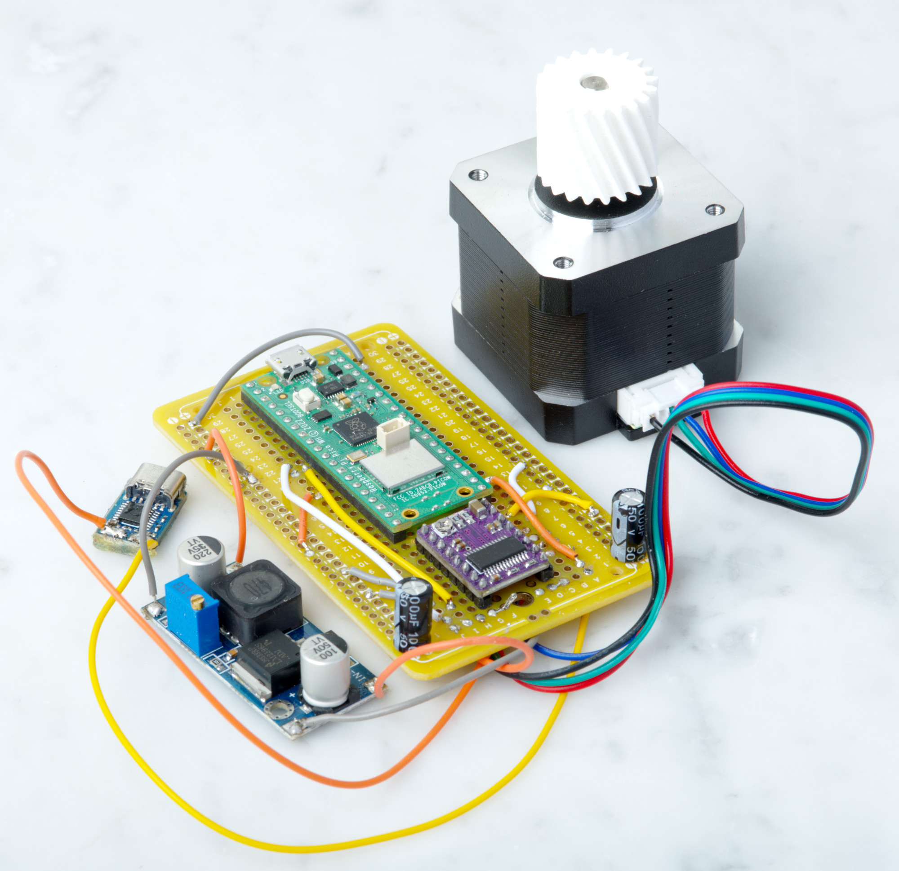
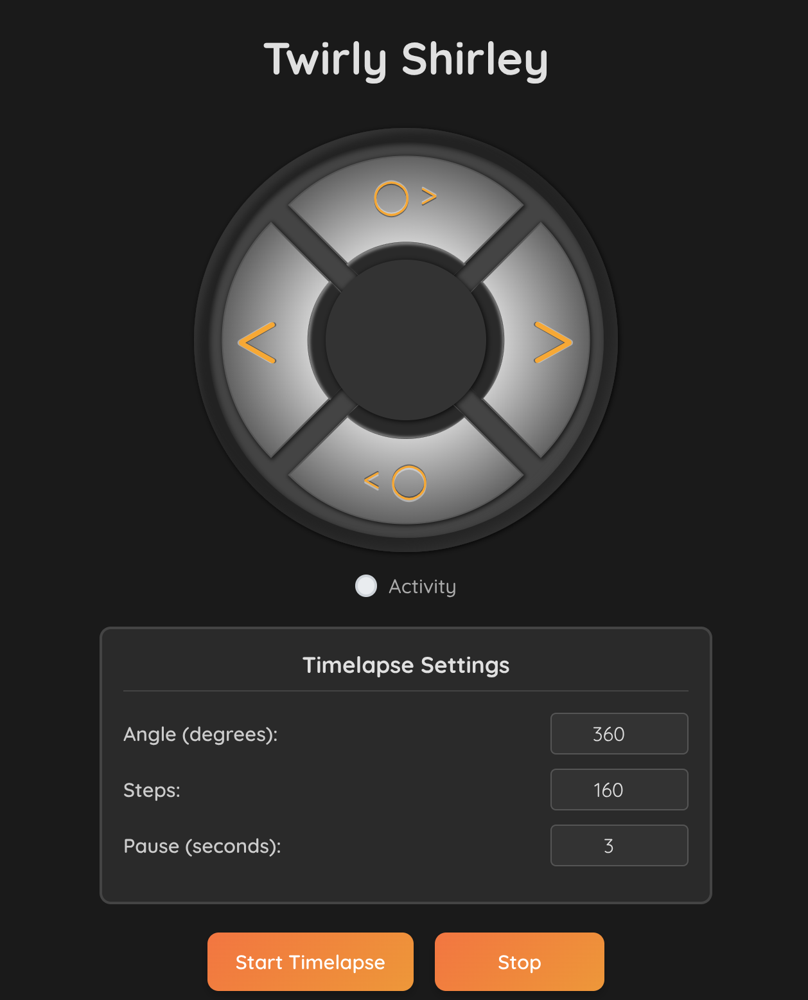
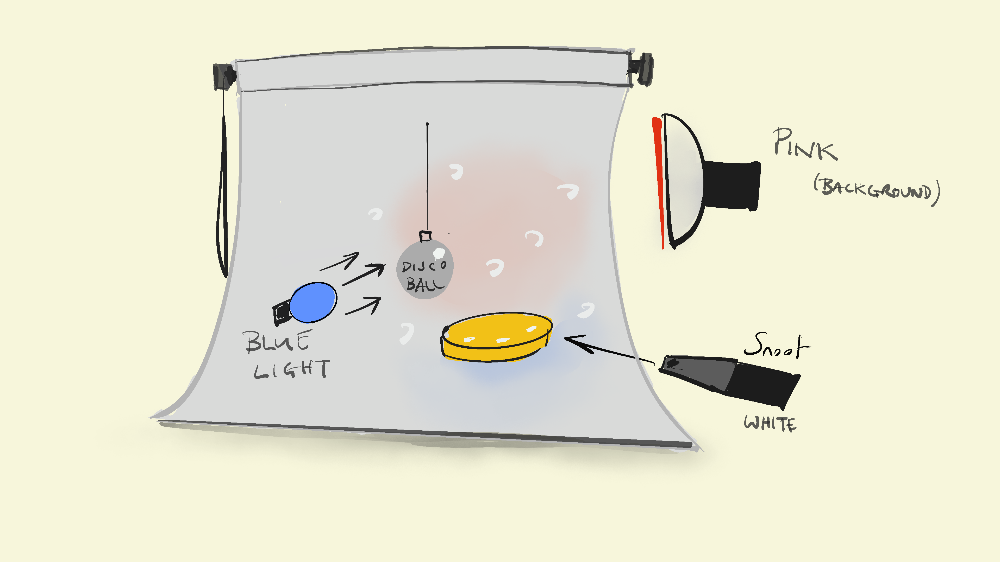

[](https://www.youtube.com/channel/UCz5BOU9J9pB_O0B8-rDjCWQ) [](https://www.instagram.com/v_e_e_b/)

# Twirly Shirley

A remote-controlled programmable precision turntable powered by USB-c, driven by a stepper motor. Useful for making stop motion video and rotating stuff that you can't (or are too lazy to) get to. 

There are relatively cheap turntables (only slightly more expensive than this DIY version) that do the same thing, but building one is more interesting/ flexible. For example, if you need to make a version for heavy weights/large items, the contents of this repository should be a good start, as well as a much cheaper option than [that kind of turntable](https://noxon.tech/en/360-turntable/).


# Hardware
- [Stepper Motor](https://www.amazon.de/TEQStone-Stepper-Printer-Degrees-Extruder/dp/B0BMX62X22/ref=sr_1_4)
- DRV8825 to control the stepper motor
- 20V PD trigger to power the turntable
- Step Down Voltage convertor (to reduce the 20V down to 5V in order to power the microcontroller)
- [Raspberry Pi Pico W](https://www.raspberrypi.com/documentation/microcontrollers/raspberry-pi-pico.html) 
- [Rotating Bearing](https://www.amazon.de/-/en/dp/B073NZ4GT4?psc=1&ref=ppx_yo2ov_dt_b_product_details)
- [3d printed gears and case](3d/)
- 2x Capacitors (100μF)


Total cost of materials: <50 USD

Build time: <2 hours (not including 3d printing time)

## Tools
- Soldering Iron
- Multimeter
- Patience

## Assembly

- Print the case. mount the Pico and DRV8825 to the prototype board, as well as the two capacitors.
- Adjust the Step-Down converter so that it outputs 5V

### Wiring

The DRV8825 needs to be wired to match the photo below. The code contains all the individual GPIO pins. The capacitors are connected to the voltage and ground for the 20V and 5V supplies respectively (providing a smoother voltage for the bridge). 

<div align="center">

</div>

That's pretty much it. You can test that the components are working and then connect the gears to the bearing and assemble them in an enclosure. There parts we used are in the [3d directory](3d/).

# Firmware

Download a `uf2` image and install it on the Pico according to the [instructions](https://www.raspberrypi.com/documentation/microcontrollers/micropython.html#drag-and-drop-micropython) on the Raspberry Pi website.

Clone this repository to your computer using the commands (from a terminal):

```
cd ~
git clone https://github.com/veebch/twirly.git
cd twirly
```

Check the port of the pico with the port listing command:
```
python -m serial.tools.list_ports
```
Now, using the port path (in our case `/dev/ttyACM0`) copy the contents to the repository by installing [ampy](https://pypi.org/project/adafruit-ampy/) and using  and the commands:

```
ampy -p /dev/ttyACM0 put main.py 
```
(*NB. make sure you are using the right port name, as shown in the port listing command above*)

Done! All the required files should now be on the Pico. Whenever you connect to power the script will autorun.

# Controls

First, give your WiFi credentials to the Pico by scanning for the WiFi and connecting to 'pi pico'. You'll be redirected to a webpage that asks for your WiFi credentials. 
Then, point a web browser at the IP of the Pico and you'll see:

<div align="center">

</div>


(It is possible to do make a control page without connecting to a router, but giving the pico W an internet connection makes it easier to add features later.)

- The > and < buttons give a **small nudge** clockwise or counterclockwise respectively.
- There is a **full circle spin** either clockwise or anticlockwise. 

# Video  

An overview of the build and a demo of it in action:

[](https://www.youtube.com/watch?v=peo0DxWtorY)
# Lighting diagram for Roller-Boot Video

<div align="center">

</div>

# Acknowledgements

The gears are made using the [openscad library by Chris Spencer](https://github.com/chrisspen/gears). 

The micropython driver for the drv8825 is by [Rob Hammerlin](https://gitlab.com/robhamerling/micropython-drv8825).

The remote control was based on [Phewap by Simon Prickett](https://github.com/simonprickett/phewap)

# Licence 

GPL 3.0
