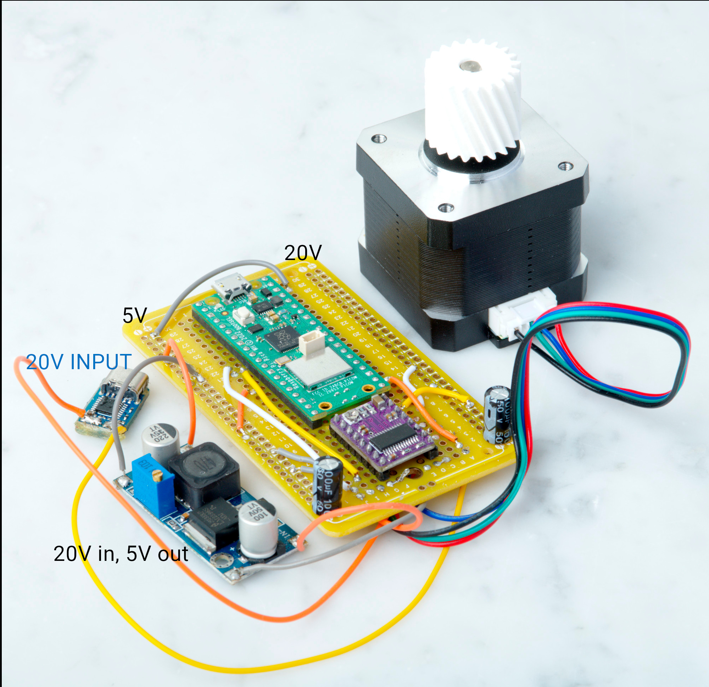

# Wiring Guide


This guide provides detailed wiring instructions for connecting the Raspberry Pi Pico W to the DRV8825 stepper motor driver.

## Required Components

- Raspberry Pi Pico W
- DRV8825 Stepper Motor Driver
- NEMA stepper motor (4-wire bipolar)
- 20V PD trigger (USB-C) for motor power supply
- Step-down converter (20V to 5V) for logic power
- 100µF capacitor (for 20V supply)
- 100µF capacitor (for 5V supply)
- Breadboard or prototype board
- Jumper wires

## Assembled Components



*Example of the assembled system showing the Raspberry Pi Pico W, DRV8825 driver, USB-C PD trigger, and step-down converter.*

## Pin Connections

### Pico W to DRV8825

| Pico W Pin | DRV8825 Pin | Function |
|------------|-------------|----------|
| GP2 | STEP | Step pulse signal |
| GP3 | DIR | Direction control |
| GP4 | ENABLE | Motor enable (active low) |
| GP6 | M0 | Microstepping bit 0 |
| GP7 | M1 | Microstepping bit 1 |
| GP8 | M2 | Microstepping bit 2 |
| GND | GND | Common ground |

### Power Supply Connections

| Connection | Description |
|------------|-------------|
| USB-C PD Trigger 20V+ → VMOT | Motor power from PD trigger |
| USB-C PD Trigger GND → GND | Motor power ground |
| Step-down Converter 5V+ → VDD | Logic power from step-down converter |
| Step-down Converter GND → GND | Logic power ground |

**Power Supply Chain**: USB-C PD Trigger (20V) → Step-down Converter → 5V Logic Supply

### Motor Connections

Connect your 4-wire bipolar stepper motor to the DRV8825 output terminals:
- **2B, 2A**: One motor coil
- **1A, 1B**: Other motor coil

**Important**: All four motor wires must be connected for proper operation.

## Microstepping Configuration

The microstepping resolution is controlled by three pins (M0, M1, M2):

| M0 | M1 | M2 | Microsteps | Resolution |
|----|----|----|------------|------------|
| L  | L  | L  | 1 (full)   | 1.8°/step |
| H  | L  | L  | 2 (half)   | 0.9°/step |
| L  | H  | L  | 4 (quarter)| 0.45°/step |
| H  | H  | L  | 8 (eighth) | 0.225°/step |
| L  | L  | H  | 16         | 0.1125°/step |
| H  | L  | H  | 32         | 0.05625°/step |

**Note**: H = High (3.3V), L = Low (0V or floating)

## Current Limiting Setup

The DRV8825 has a built-in current limiting feature that must be properly configured:

### Step-by-Step Current Setting

1. **Calculate Target Current**: Check your motor's rated current (typically 1-2A)

2. **Measure Reference Voltage**: 
   - Connect multimeter between GND and the small potentiometer on the DRV8825
   - Measure the voltage while the driver is powered

3. **Calculate Required Voltage**:
   ```
   VREF = Current_Limit × 8 × Rsense
   ```
   For DRV8825: `VREF = Current_Limit × 8 × 0.1 = Current_Limit × 0.8`
   
   Example: For 1.5A current limit: `VREF = 1.5 × 0.8 = 1.2V`

4. **Adjust Potentiometer**: 
   - Use a small screwdriver to turn the potentiometer
   - Clockwise increases current, counter-clockwise decreases
   - Adjust until VREF matches your calculated value

### Important Safety Notes

- Set current limit BEFORE connecting the motor
- Start with a lower current and increase gradually
- Monitor motor temperature during operation
- The driver will get warm during normal operation

## Power Supply Filtering

Add capacitors near the DRV8825 to filter power supply noise:

- **470µF capacitor**: Connect across 20V PD trigger output (VMOT to GND)
- **100µF capacitor**: Connect across 5V step-down converter output (VDD to GND)

These capacitors smooth voltage fluctuations and protect against voltage spikes from the USB-C PD trigger and step-down converter.

## Wiring Checklist

Before powering on, verify:

- [ ] All pin connections are secure
- [ ] Power supply polarities are correct
- [ ] Motor wires are properly connected (all 4 wires)
- [ ] Current limit is set appropriately
- [ ] Capacitors are installed for power filtering
- [ ] No short circuits between power rails
- [ ] Common ground connections are established

## Common Wiring Issues

- **Motor not moving**: Check that all 4 motor wires are connected
- **Erratic movement**: Verify power supply filtering and current limit setting
- **Driver overheating**: Reduce current limit or improve heat dissipation
- **No response**: Check enable pin connection and power supplies
